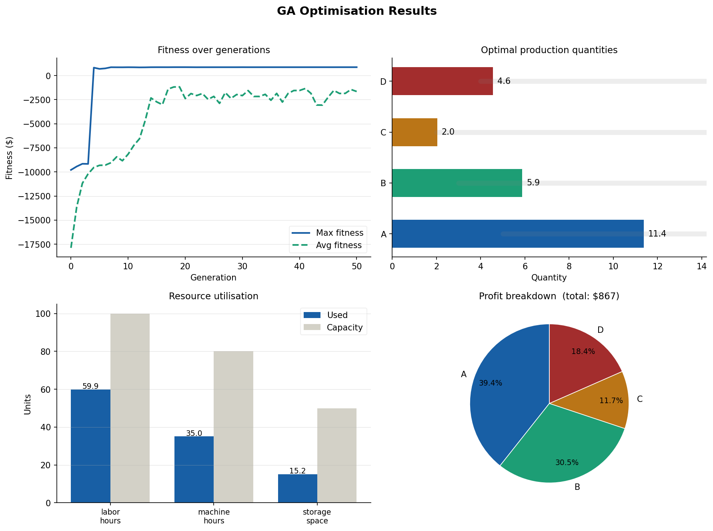

# GA Production Planning Example

A single-file Python example that uses **DEAP**'s `eaSimple` genetic algorithm to solve a
constrained production-planning optimisation problem: given four products (A–D), three shared
resources, and a set of business rules, find the production quantities that maximise total profit.



*2 × 2 summary plot produced automatically at the end of each run: fitness evolution,
optimal quantities, resource utilisation, and profit breakdown by product.*

---

## Problem description

| | Product A | Product B | Product C | Product D |
|---|---|---|---|---|
| **Profit / unit ($)** | 30 | 45 | 50 | 35 |
| **Cost / unit ($)** | 10 | 15 | 20 | 12 |
| **Weight / unit** | 2.0 | 3.0 | 4.0 | 2.5 |
| **Min quantity** | 5 | 3 | 2 | 4 |
| **Max quantity** | 20 | 25 | 15 | 30 |

Three resources are shared across all products:

| Resource | Capacity |
|---|---|
| Labor hours | 100 |
| Machine hours | 80 |
| Storage space | 50 |

### Constraints

In addition to the per-product quantity bounds, every candidate solution must satisfy:

1. **Resource capacity** – total consumption of each resource must not exceed its capacity.
2. **Minimum quantities** – each product must be produced in at least its stated minimum.
3. **Weight limit** – total weighted load across all products must not exceed 60 units.
4. **Ratio rule** – quantity of Product B must be ≥ 30 % of Product A's quantity.

Infeasible individuals are penalised in the fitness function rather than rejected outright,
which lets the GA explore and "escape" from violated regions smoothly.

---

## Algorithm

The optimisation is performed by DEAP's `eaSimple` with the following configuration:

| Parameter | Value |
|---|---|
| Population size | 100 |
| Generations | 50 |
| Crossover probability | 0.8 |
| Mutation probability | 0.2 |
| Crossover operator | `cxBlend` (α = 0.5) |
| Mutation operator | `mutGaussian` (σ = 2, per-gene prob = 0.2) |
| Selection | Tournament (size 3) |
| Elitism | Hall of Fame (top 1 individual) |

A **repair step** is applied after mutation and crossover to clamp each gene back into its
`[min_quantity, max_quantity]` range.

### References

- T. Bäck, *Evolutionary Algorithms in Theory and Practice*, Oxford University Press, 1996.
  `eaSimple` implements the canonical generational GA described in Chapter 7.
- F.-A. Fortin, F.-M. De Rainville, M.-A. Gardner, M. Parizeau, C. Gagné,
  "DEAP: Evolutionary Algorithms Made Easy",
  *Journal of Machine Learning Research*, vol. 13, pp. 2171–2175, Jul 2012.
  [PDF](https://www.jmlr.org/papers/volume13/fortin12a/fortin12a.pdf)
- DEAP API documentation: [deap.readthedocs.io/en/master/api/algo.html](https://deap.readthedocs.io/en/master/api/algo.html)

---

## Algorithm comparison: `eaSimple` vs NSGA-II vs NSGA-III

| | `eaSimple` | NSGA-II | NSGA-III |
|---|---|---|---|
| **Objectives** | Single | Multi (2–3) | Many (3+) |
| **Selection mechanism** | Tournament | Non-dominated sorting + crowding distance | Non-dominated sorting + reference points |
| **Pareto front** | No | Yes | Yes |
| **Diversity preservation** | None | Crowding distance | Structured reference points on a hyperplane |
| **Constraint handling** | Penalty in fitness | Penalty or feasibility rules | Penalty or feasibility rules |
| **DEAP entry point** | `algorithms.eaSimple` | `algorithms.eaMuPlusLambda` + `selNSGA2` | `algorithms.eaMuPlusLambda` + `selNSGA3` |
| **Complexity / generation** | O(N) | O(N² · M) | O(N² · M) |
| **Typical use case** | Single-objective problems with simple constraints | Bi- / tri-objective trade-off problems | Problems with 4+ conflicting objectives |

### When to use which

**`eaSimple`** (this example) is the right choice when there is a single scalar objective (e.g., maximise profit) and diversity of the population is not a concern. It is the simplest and fastest of the three.

**NSGA-II** is the standard workhorse for problems with two or three competing objectives (e.g., minimise cost *and* maximise throughput). Its crowding-distance operator keeps solutions spread along the Pareto front, but the mechanism degrades in higher-dimensional objective spaces.

**NSGA-III** replaces crowding distance with a set of structured reference points distributed uniformly on a normalised hyperplane. This maintains good spread even with four or more objectives, at the cost of needing to supply (or generate) the reference point set upfront.

All three algorithms share the same DEAP building blocks — `creator`, `toolbox`, crossover/mutation operators, and `HallOfFame` — so migrating between them mainly involves changing the selection operator and adjusting the fitness weights tuple.

### Fitness function

```
fitness = total_profit − penalty
```

The penalty starts at 10 000 for any constraint violation and grows proportionally with the
magnitude of each violation (100 × excess resource units; 50 × excess weight), steering
the population towards feasibility while preserving gradient information.

---

## Output

Running the script produces:

- `products_ga.csv`, `resources_ga.csv`, `requirements_ga.csv` – input tables (useful as
  templates for substituting your own data).
- `ga_results.png` – the 2 × 2 summary figure shown above.
- A SHA-256 digest of the final-generation statistics line, printed to stdout (handy as a
  reproducibility fingerprint).

Console output includes a per-generation statistics table (DEAP's verbose logbook), a
formatted results table, resource utilisation percentages, and constraint-verification
checks.

---

## Requirements

```
python >= 3.11  # tested on 3.11, 3.12, 3.13
deap
numpy
pandas
matplotlib
```

Install with:

```bash
pip install deap numpy pandas matplotlib
```

---

## Usage

```bash
# Run in the current directory (saves CSVs and PNG here)
python easimple_ex.py

# Specify an output directory
python easimple_ex.py /path/to/output/dir

# Specify output directory and plot auto-close timeout (ms)
python easimple_ex.py /path/to/output/dir 3000
```

The script auto-selects the `TkAgg` matplotlib backend when a `$DISPLAY` is available and
falls back to `Agg` otherwise, so it works equally well in interactive sessions, Docker
containers, and CI pipelines.

### Using your own data

Replace the three inline `pd.DataFrame` definitions near the top of the file with
`pd.read_csv(...)` calls:

```python
products_data      = pd.read_csv('your_products.csv')
resources_data     = pd.read_csv('your_resources.csv')
requirements_data  = pd.read_csv('your_requirements.csv')
```

Column names must match those in the generated CSV templates.

---

## Sample results

With the built-in data and `random.seed(42)` the GA converges to:

| Product | Quantity | Total profit ($) |
|---|---|---|
| A | 11.4 | 342 |
| B | 5.9 | 266 |
| C | 2.0 | 101 |
| D | 4.6 | 161 |
| **Total** | | **$867** |

Resource utilisation at optimum: labor 59.9 / 100 (60 %), machine 35.0 / 80 (44 %),
storage 15.2 / 50 (30 %). All constraints satisfied.

---

## License

Copyright © 2025–2026 Dmitry Messerman. Licensed under the
[GNU General Public License v3.0](https://www.gnu.org/licenses/gpl-3.0.html).
